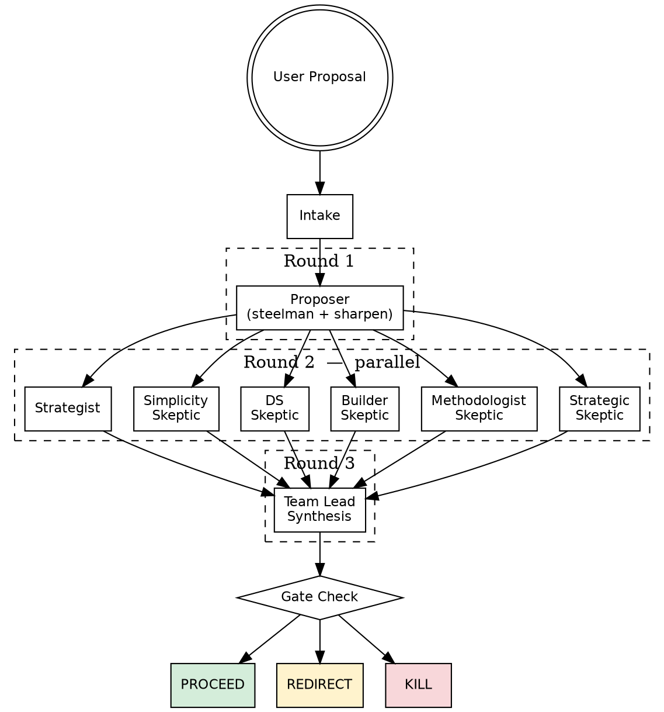
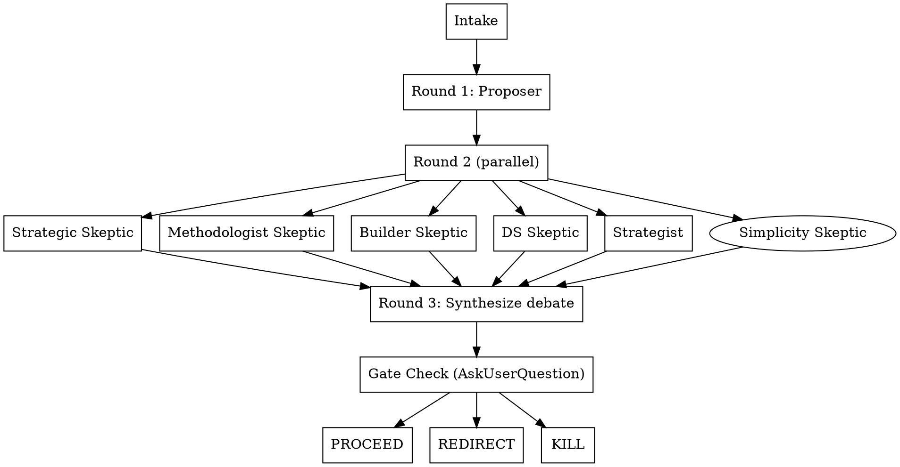

# Engineering Strategy



## Overview

Stress-tests engineering proposals through a **3-round multi-agent debate** before committing. Round 1: Proposer steelmans the idea. Round 2: Four specialized Skeptics challenge the Proposer's output in parallel, Strategist reads all. Round 3: Team lead synthesizes the full debate, then presents a **Proceed / Redirect / Kill** gate check.

## Prerequisite

`CLAUDE_CODE_EXPERIMENTAL_AGENT_TEAMS=1` must be set. Verify before launching agents:

```bash
echo $CLAUDE_CODE_EXPERIMENTAL_AGENT_TEAMS
```

If unset, inform the user and stop. In most configured environments this is already set via SessionStart hook.

---

## Execution Flow



---

## Step 1: Intake

If the proposal is vague or incomplete, ask one clarifying question:
- What problem does this solve?
- What constraints exist (team size, timeline, existing infra)?

If reasonably clear, proceed immediately.

---

## Step 2 (Round 1) — Proposer

Launch a single agent. Pass the full proposal as `{proposal}`.

### Proposer Prompt

```
You are the Proposer. Steelman and sharpen the following engineering proposal.

PROPOSAL:
{proposal}

Produce:
1. Restatement of the proposal at its strongest
2. Explicit assumptions filling underspecified gaps (call them out)
3. Proposed architecture: components, data flow, key APIs
4. Key technical decisions and rationale
5. Success metrics
6. Implementation phases: MVP → scale

Be constructive and specific. Do not critique.
```

**Wait for Proposer output before proceeding to Round 2.**

---

## Step 3 (Round 2) — 5 Skeptics + Strategist in Parallel

**CRITICAL:** All six Agent tool calls must be in a single message. Do not stagger.

Each Skeptic receives: (a) the original proposal, and (b) the full Proposer output from Round 1.
The Strategist receives: (a) the original proposal, (b) Proposer output, and all five Skeptic outputs are NOT yet available — Strategist reads Proposer only.

Pass `{proposal}` and `{proposer_output}` into each prompt below.

### Strategic Skeptic Prompt

```
You are the Strategic Skeptic. Challenge the strategic framing of this proposal.

ORIGINAL PROPOSAL:
{proposal}

PROPOSER'S STEELMAN:
{proposer_output}

Challenge:
1. Is this the right goal? What is the opportunity cost of doing this instead of alternatives?
2. What strategic assumptions could be wrong (org priorities, market, timing)?
3. Does the Proposer's framing hide a simpler or better alternative?
4. Who benefits from this being built — and who loses? Are those the right stakeholders?
5. What would make this obviously wrong in 12 months?

Be adversarial. Do not propose fixes — document strategic problems only.
```

### Methodologist Skeptic Prompt

```
You are the Methodologist Skeptic. Challenge the scientific and technical validity of this proposal.

ORIGINAL PROPOSAL:
{proposal}

PROPOSER'S STEELMAN:
{proposer_output}

Challenge:
1. Are the evaluation metrics valid? Can they be gamed or do they miss the real outcome?
2. What are the validity threats — confounders, selection bias, distribution shift?
3. Is the methodology well-specified enough to be reproduced or audited?
4. What has been underspecified that will cause problems at evaluation time?
5. What prior work or precedent contradicts the approach or has tried this and failed?

Be rigorous. Do not propose fixes — document validity problems only.
```

### Builder Skeptic Prompt

```
You are the Builder Skeptic. Challenge the implementation feasibility of this proposal.

ORIGINAL PROPOSAL:
{proposal}

PROPOSER'S STEELMAN:
{proposer_output}

Challenge:
1. What will be harder to build than the Proposer assumes? Be specific about the hard parts.
2. What operational burden does this create post-launch (on-call, debugging, maintenance)?
3. What dependencies, blockers, or cross-team coordination has been glossed over?
4. Where will the implementation diverge from the design under real constraints?
5. What's the most likely way this fails after launch, not before?

Be concrete. Do not propose fixes — document build and operational problems only.
```

### DS Skeptic Prompt

```
You are the DS Skeptic. Challenge the data and statistical claims in this proposal.

ORIGINAL PROPOSAL:
{proposal}

PROPOSER'S STEELMAN:
{proposer_output}

Challenge:
1. Is the sample size sufficient? What is the statistical power for the claimed effect sizes?
2. Does the evaluation data represent production distribution? What distribution shift exists?
3. Are offline metrics predictive of online impact? What is the offline-to-online gap risk?
4. What data quality issues, label noise, or collection artifacts could invalidate results?
5. Are confidence intervals, significance thresholds, and baselines clearly defined?

Be rigorous. Do not propose fixes — document data and statistical problems only.
```

### Simplicity Skeptic Prompt

```
You are the Simplicity Skeptic. Challenge the complexity of this design and assess who is genuinely best positioned to own it.

ORIGINAL PROPOSAL:
{proposal}

PROPOSER'S STEELMAN:
{proposer_output}

Challenge:
1. Is this design more complex than the problem requires? What is the simplest architecture that solves the stated problem — and what does the proposal add on top of that?
2. Which components could be deleted or deferred without losing core V1 value? What is the irreducible minimum?
3. Who in this org is genuinely best positioned to build this — considering: data access, codebase familiarity, cross-team relationships, and available time? Is that the proposer?
4. What does the proposer's background optimize for (e.g., ML depth, infra breadth, product sense) — and does that match what this proposal actually requires to succeed?
5. If someone with no prior art were handed this problem and told to ship something useful in half the time, what would they build — and is that actually better?

Be direct. Do not propose fixes — document complexity mismatches and ownership risks only.
```

---

### Strategist Prompt

```
You are the Strategist. Evaluate fit, tradeoffs, and org readiness.

ORIGINAL PROPOSAL:
{proposal}

PROPOSER'S STEELMAN:
{proposer_output}

Produce:
1. Build vs buy vs defer — recommendation and why
2. Org readiness: team capability, cross-team dependencies, ownership model
3. Cost model: engineering weeks, infra costs, ongoing maintenance
4. Strategic alignment: does this serve the right goal at the right time?
5. Risk-adjusted recommendation: GO / NO-GO / DEFERRED — with specific conditions

Be direct. Give a clear recommendation with reasoning.
```

---

## Step 4 (Round 3) — Synthesize the Debate

After all five agents return, synthesize as team lead. Structure:

```
## Proposal (Proposer)
[3-5 bullets: core design, key decisions, success metrics]

## Strategic Challenge
[Top 1-2 points from Strategic Skeptic]

## Methodological Challenge
[Top 1-2 points from Methodologist Skeptic]

## Build Challenge
[Top 1-2 points from Builder Skeptic]

## Data / Stats Challenge
[Top 1-2 points from DS Skeptic]

## Simplicity & Ownership Challenge
[Top 1-2 points from Simplicity Skeptic — is the design overbuilt? Is the proposer the right person?]

## Strategic Recommendation
- Build/Buy/Defer: [Strategist recommendation]
- Cost estimate: [rough numbers]
- GO / NO-GO / DEFERRED: [verdict + conditions]

## Decisive Blocker (if any)
[The single highest-severity objection across all skeptics — the one that would kill this]
```

---

## Step 5: Gate Check

Present synthesis, then use `AskUserQuestion` with exactly 3 options:

```
Question: "How do you want to proceed?"

Options:
  PROCEED  — "Ship it. Skeptic concerns addressed in implementation."
  REDIRECT — "Revise first. [decisive blocker in <8 words]"
  KILL     — "Not worth it. Move on."
```

Pre-fill `REDIRECT` label with the decisive blocker from synthesis, summarized in <8 words.

---

## Step 6: Act on Gate

### On PROCEED

```
## Next Steps

- [ ] Write design doc stub (owner: ?, due: ?)
- [ ] Address [top blocker]: [mitigation]
- [ ] Address [second blocker]: [mitigation]
- [ ] Assign implementation owner
- [ ] Set kickoff timeline
```

### On REDIRECT

```
## Revision Required

Before re-evaluating, address:
- [Decisive blocker — specific]
- [What information or design change resolves it]
- [What a good answer looks like]

Re-run /engineering-strategy when revised.
```

### On KILL

```
## Kill Record

**Proposed:** [one sentence]
**Why killed:** [one sentence — decisive reason]
**Instead:** [one sentence — what to do instead]

→ Capture in PARA if this decision should be logged.
```
